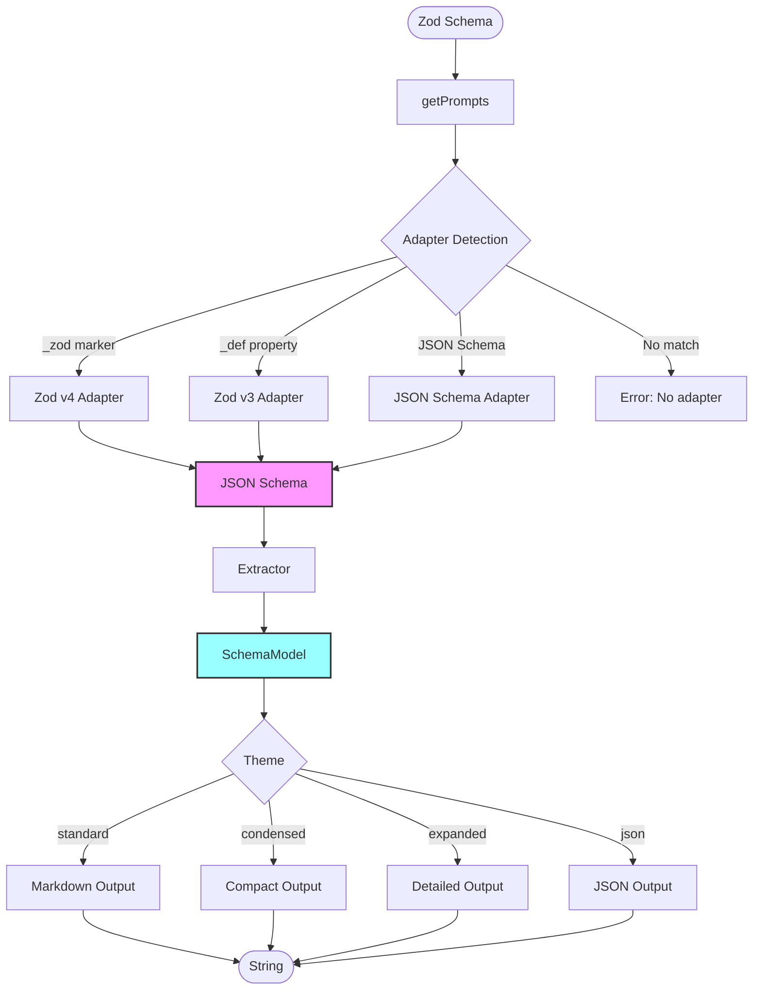

# Contributing to prompt-schema

## Architecture Overview

The library uses a clean 3-layer architecture that separates concerns:



## Project Structure

```
src/
├── index.ts                    # getPrompts() entry point
├── PromptSchema.ts             # Core class, adapter registry
├── types.ts                    # JsonSchema, SchemaAdapter types
│
├── adapters/                   # Layer 1: Schema → JSON Schema
│   ├── zod-v3.ts              # Zod v3 (uses zod-to-json-schema)
│   ├── zod-v4.ts              # Zod v4 (uses zod/v4/core)
│   └── json-schema.ts         # JSON Schema pass-through
│
├── extractors/                 # Layer 2: JSON Schema → Model
│   ├── extractToModel.ts      # Main extraction entry point
│   ├── extractField.ts        # Single field extraction
│   ├── extractObjectFields.ts # Object property extraction
│   ├── extractArrayField.ts   # Array field handling
│   ├── extractArrayItemType.ts# Array item type detection
│   ├── extractUnionField.ts   # Union type extraction
│   ├── extractUnionData.ts    # Union data helpers
│   ├── extractConstraints.ts  # Validation constraints
│   ├── types.ts               # SchemaModel, SchemaField types
│   └── utils/
│       ├── detectFieldType.ts # Field type detection
│       ├── unwrapNullable.ts  # Nullable type handling
│       ├── getVariantType.ts  # Union variant helpers
│       └── findDiscriminator.ts # Discriminator detection
│
├── formatters/                 # Layer 3: Model → String
│   ├── formatModel.ts         # Main formatting entry point
│   ├── ThemeRegistry.ts       # Theme management
│   ├── types.ts               # BaseTheme, SchemaTheme interfaces
│   ├── index.ts               # Formatter exports
│   └── themes/
│       ├── standard-theme.ts  # Clean Markdown output
│       ├── expanded-theme.ts  # Detailed with examples
│       ├── condensed-theme.ts # Token-efficient format
│       └── json-theme.ts      # Structured JSON output
│
examples/                       # Example schemas & runners
├── schemas-v3.ts              # Zod v3 examples
├── schemas-v4.ts              # Zod v4 examples
├── run-v3.ts                  # v3 test runner
└── run-v4.ts                  # v4 test runner

tests/                          # Test suite
├── core.test.ts               # PromptSchema class tests
├── adapters.test.ts           # Adapter tests
└── integration.test.ts        # End-to-end tests
```

## Processing Pipeline

### Layer 1: Adapters

**Location**: `src/adapters/`

Converts schema formats to JSON Schema:

```typescript
interface SchemaAdapter<T = unknown> {
  name: string;
  canHandle: (schema: unknown) => boolean;
  toJsonSchema: (schema: T, options?: unknown) => JsonSchema;
}
```

### Layer 2: Extractors

**Location**: `src/extractors/`

Extracts JSON Schema into a type-safe intermediate model:

```typescript
interface SchemaModel {
  fields: SchemaField[];
  metadata?: { title?: string; description?: string };
}

interface SchemaField {
  name: string;
  type: FieldType;
  isRequired: boolean;
  isNullable?: boolean;
  constraints?: FieldConstraint[];
  enumValues?: string[];
  objectFields?: SchemaField[];
  arrayItemType?: FieldType | SchemaField;
  unionVariants?: UnionVariant[];
  // ... more properties
}
```

### Layer 3: Formatters

**Location**: `src/formatters/`

Renders the model to different output formats. All themes extend `BaseTheme`:

```typescript
abstract class BaseTheme implements SchemaTheme {
  abstract name: string;
  abstract description: string;
  abstract format(model: SchemaModel, options?: ThemeOptions): string;
  abstract formatField(field: SchemaField, depth: number, options?: ThemeOptions): string;

  protected indent(depth: number, options?: ThemeOptions): string;
  protected formatType(field: SchemaField): string;
  protected formatModifiers(field: SchemaField): string[];
}
```

## Adding a New Adapter

To support schema libraries beyond Zod (e.g., TypeBox, Yup, Joi):

### 1. Create the Adapter

Create `src/adapters/your-schema.ts`:

```typescript
import type { JsonSchema, SchemaAdapter } from '../types';

export const yourSchemaAdapter: SchemaAdapter = {
  name: 'your-schema',

  canHandle: (schema: unknown): boolean => {
    return typeof schema === 'object' && schema !== null && '_yourMarker' in schema;
  },

  toJsonSchema: (schema: unknown): JsonSchema => {
    // Convert your schema format to JSON Schema
    return {
      type: 'object',
      properties: {
        /* ... */
      },
      required: ['field1'],
    };
  },
};
```

### 2. Export from Index

Update `src/index.ts`:

```typescript
export { yourSchemaAdapter } from './adapters/your-schema';
```

### 3. Add Tests

Add tests in `tests/adapters.test.ts`:

```typescript
describe('YourSchema Adapter', () => {
  it('should detect your schema format', () => {
    const schema = createYourSchema({ field: 'string' });
    expect(yourSchemaAdapter.canHandle(schema)).toBe(true);
  });

  it('should convert to JSON Schema', () => {
    const schema = createYourSchema({ field: 'string' });
    const jsonSchema = yourSchemaAdapter.toJsonSchema(schema);
    expect(jsonSchema.type).toBe('object');
  });
});
```

## Adding a New Theme

### 1. Create the Theme

Create `src/formatters/themes/your-theme.ts`:

```typescript
import { BaseTheme, type ThemeOptions } from '../types';
import type { SchemaField, SchemaModel } from '../../extractors/types';

export class YourTheme extends BaseTheme {
  name = 'your-format';
  description = 'Your custom format description';

  format(model: SchemaModel, options?: ThemeOptions): string {
    let output = '';

    for (const field of model.fields) {
      output += this.formatField(field, 0, options);
    }

    return output.trim();
  }

  formatField(field: SchemaField, depth: number, options?: ThemeOptions): string {
    const indent = this.indent(depth, options);
    const type = this.formatType(field);
    const modifiers = this.formatModifiers(field);

    return `${indent}${field.name}: ${type} (${modifiers.join(', ')})\n`;
  }
}
```

### 2. Register the Theme

Update `src/formatters/formatModel.ts` to include your theme.

### 3. Update Types

Add your theme to `ThemeStyle` in `src/formatters/types.ts`:

```typescript
export type ThemeStyle = 'condensed' | 'standard' | 'expanded' | 'json' | 'your-format';
```

## Development

### Setup

```bash
pnpm install
```

### Commands

```bash
# Build
pnpm build

# Run tests
pnpm test

# Run tests once
pnpm test:run

# Run examples
pnpm example:v3
pnpm example:v4

# Run specific example with theme
pnpm example:v3 flatSchema expanded
```

## Type Safety

The codebase maintains strict type safety:

- **No `any` types**: Use `unknown` for public APIs, concrete types internally
- **Type guards**: Proper type narrowing with `typeof` and `in` checks
- **Generics**: `SchemaAdapter<T>` for type-safe adapter implementations

## Code Style

- Clean functions with single responsibility
- Self-documenting code (minimal comments)
- Prefer `const` and avoid mutations
- Test edge cases: null, undefined, empty arrays, deep nesting

## Releasing

To publish a new version to npm:

```bash
# 1. Ensure you're on main and up to date
git checkout main && git pull

# 2. Bump version (choose one)
npm version patch   # 1.0.0 → 1.0.1 (bug fixes)
npm version minor   # 1.0.0 → 1.1.0 (new features)
npm version major   # 1.0.0 → 2.0.0 (breaking changes)

# 3. Publish to npm (runs build, tests, lint automatically)
npm publish

# 4. Push version commit and tag to GitHub
git push && git push --tags
```

## Questions?

Open an issue or submit a PR. Contributions welcome!
