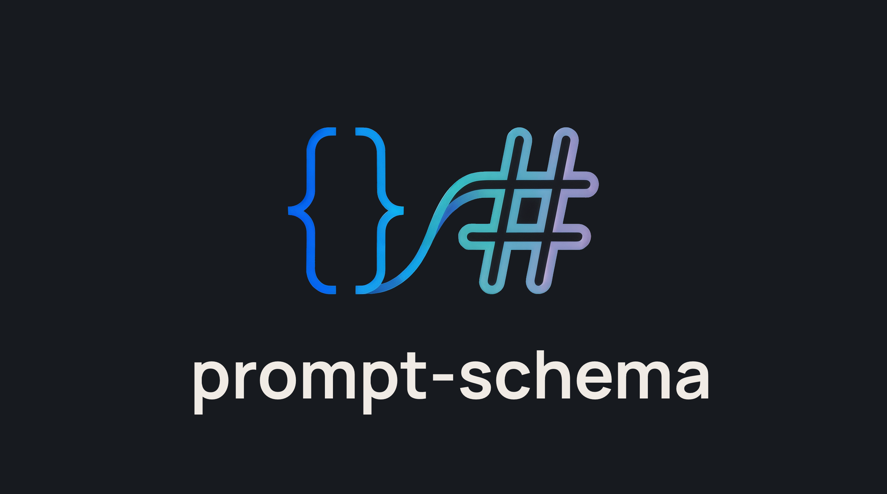

# prompt-schema

**Convert Zod schemas to AI prompts in Markdown.**



[](https://www.npmjs.com/package/prompt-schema)
[](https://opensource.org/licenses/MIT)

---

## Table of Contents

- [What is this?](#what-is-this)
- [Quick Start](#quick-start)
- [Themes](#themes)
- [Options](#options)
- [Advanced Usage](#advanced-usage)
- [API Reference](#api-reference)
- [Supported Features](#supported-features)
- [License](#license)

---

## What is this?

When using LLMs with structured output (OpenAI function calling, AI SDK `generateObject`, etc.), you need to tell the model what schema to follow. This library converts your Zod schemas into clear, Markdown-formatted prompt instructions that LLMs understand well.

**Before** (raw JSON Schema dumped into prompt):

```json
{
  "type": "object",
  "properties": {
    "name": { "type": "string", "maxLength": 100 },
    "email": { "type": "string", "format": "email" },
    "age": { "type": "number", "minimum": 0, "maximum": 120 }
  },
  "required": ["name", "email", "age"]
}
```

**After** (prompt-schema output):

```
## Schema

- name: string (required • max 100 chars)
- email: string (required • format: email)
- age: number (required • min: 0 • max: 120)
```

---

## Quick Start

### Install

```bash
npm install prompt-schema zod
```

> Requires `zod@^3.25.0` (includes both v3 and v4 APIs)

### Basic Usage

```typescript
import { getPrompts } from 'prompt-schema';
import { z } from 'zod/v3';

const schema = z.object({
  name: z.string().max(100),
  email: z.string().email(),
  age: z.number().min(0).max(120),
});

const prompt = getPrompts(schema);
```

Output:

```
## Schema

- name: string (required • max 100 chars)
- email: string (required • format: email)
- age: number (required • min: 0 • max: 120)
```

---

## Themes

Choose an output format that fits your use case. The `standard`, `expanded`, and `condensed` themes output Markdown, which LLMs parse reliably:

### Standard (default)

Clean and readable, optimized for AI prompts:

```
## Schema

- name: string (required)
- age: number (required • min: 0)
- email: string (required • format: email)
```

### Condensed

Ultra-compact for token efficiency:

```
name:str!
age:num![≥0]
email:str![@]
```

### Expanded

Includes full constraint details:

```
## Schema

- name: string (required)
- age: number (required • min: 0)
- email: string (required • pattern: ^[...] • format: email)

## Examples

{ "name": "John Doe", "age": 30, "email": "john@example.com" }
```

### JSON

Structured data for programmatic use:

```json
{
  "schema": {
    "fields": [
      { "name": "name", "type": "string", "required": true },
      { "name": "age", "type": "number", "required": true, "constraints": { "min": 0 } },
      { "name": "email", "type": "string", "required": true, "constraints": { "format": "email" } }
    ]
  }
}
```

### Using Themes

```typescript
const prompt = getPrompts(schema, { theme: 'condensed' });
```

---

## Options

| Option     | Type                                                      | Default      | Description                                          |
| ---------- | --------------------------------------------------------- | ------------ | ---------------------------------------------------- |
| `theme`    | `'standard'` \| `'condensed'` \| `'expanded'` \| `'json'` | `'standard'` | Output format                                        |
| `maxDepth` | `number`                                                  | `3`          | Maximum nesting depth for objects/arrays             |
| `safe`     | `boolean`                                                 | `false`      | Return fallback message on error instead of throwing |

---

## Advanced Usage

### Zod v4 with Examples

Zod v4 supports `.meta()` for adding examples:

```typescript
import { getPrompts } from 'prompt-schema';
import { z } from 'zod/v4';

const schema = z
  .object({
    username: z.string().min(3).max(20),
    age: z.number().min(18),
  })
  .meta({
    examples: [{ username: 'john_doe', age: 25 }],
  });

const prompt = getPrompts(schema, { theme: 'expanded' });
```

### Complex Types

```typescript
import { z } from 'zod/v3';

// Unions
const unionSchema = z.object({
  value: z.union([z.string(), z.number(), z.boolean()]),
});
// → value: string | number | boolean (required)

// Tuples
const tupleSchema = z.object({
  coordinates: z.tuple([z.number(), z.number()]),
});
// → coordinates: [number, number] (required)

// Records
const recordSchema = z.object({
  metadata: z.record(z.string(), z.string()),
});
// → metadata: Record<string, string> (required)

// Discriminated Unions
const notificationSchema = z.object({
  notification: z.discriminatedUnion('type', [
    z.object({ type: z.literal('email'), to: z.string().email() }),
    z.object({ type: z.literal('sms'), phone: z.string() }),
  ]),
});
```

### Custom Adapters

For advanced use cases, use the `PromptSchema` class directly:

```typescript
import { PromptSchema, zodV3Adapter, zodV4Adapter, jsonSchemaAdapter } from 'prompt-schema';

const converter = new PromptSchema();
converter.registerAdapter(zodV4Adapter);
converter.registerAdapter(zodV3Adapter);
converter.registerAdapter(jsonSchemaAdapter);

const prompt = converter.toPrompt(schema, { theme: 'expanded' });
```

See [CONTRIBUTING.md](./CONTRIBUTING.md) for creating custom adapters.

---

## API Reference

### `getPrompts(schema, options?)`

Main entry point. Auto-detects Zod v3 or v4.

```typescript
function getPrompts(schema: unknown, options?: ContextOptions): string;
```

### `PromptSchema` Class

```typescript
class PromptSchema {
  registerAdapter(adapter: SchemaAdapter): void;
  toPrompt(schema: unknown, options?: ContextOptions): string;
  getAdapters(): string[];
}
```

### Types

```typescript
interface ContextOptions {
  theme?: 'standard' | 'condensed' | 'expanded' | 'json';
  maxDepth?: number;
  safe?: boolean;
}

interface SchemaAdapter<T = unknown> {
  name: string;
  canHandle: (schema: unknown) => boolean;
  toJsonSchema: (schema: T, options?: unknown) => JsonSchema;
}
```

---

## Supported Features

### Fully Supported

- Objects with nested properties
- Arrays with typed items
- Tuples (fixed-length arrays)
- Records (dynamic key-value maps)
- Enums and literal values
- Optional and nullable fields
- Discriminated unions
- Regular unions
- Date types (`z.date()` → `format: date-time`)
- All Zod constraints (min, max, length, regex, format)
- Zod v3 and v4

### Partially Supported

- **Intersections** - Treated as merged objects, may lose some type information

### Not Supported

These Zod features don't translate to JSON Schema:

- `transform()`, `refine()` - Runtime-only validations
- `lazy()` - Recursive schemas would cause infinite loops
- `set()`, `map()` - No JSON Schema equivalent
- `bigint()`, `symbol()`, `function()`, `promise()` - Not serializable
- `never()`, `unknown()`, `any()`, `void()`, `undefined()`, `nan()` - Fall back to generic types

---

## License

MIT - Created by [Joe Seifi](https://github.com/joeshub)
